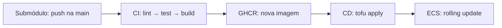

# OpenTofu — Infraestrutura AWS como Código

## Visão Geral

Implementar a infraestrutura AWS da SafeHire AI Platform usando **OpenTofu** (fork open-source do Terraform, Apache 2.0).

### Por que OpenTofu?
- 100% compatível com providers AWS, HCL e módulos Terraform
- Licença Apache 2.0 (sem restrições BSL da HashiCorp)
- Mantido pela Linux Foundation
- Maturidade e ecossistema idênticos ao Terraform

### Por que DynamoDB para state locking?
- Impede que duas execuções do `tofu apply` rodem simultaneamente e corrompam o state
- Custo irrelevante (~$0.01/mês com PAY_PER_REQUEST)
- Configuração de uma linha no backend S3
- Sem ele, se você e o CI/CD rodarem apply juntos, o state pode corromper e perder recursos

---

## Arquitetura

```
infra/tofu/
├── bootstrap/               # Cria S3 + DynamoDB para state (roda uma vez)
│   └── main.tf
│
├── versions.tf              # Provider AWS, backend S3 + DynamoDB
├── main.tf                  # Chamada dos módulos
├── variables.tf             # Variáveis globais
├── outputs.tf               # Outputs (RDS endpoint, SQS URL, etc.)
├── locals.tf                # Tags e namespaces
│
├── modules/
│   ├── networking/          # VPC, subnets, security groups
│   ├── iam/                 # IAM roles (ECS execution + task)
│   ├── ecs/                 # Cluster Fargate + task defs + services
│   ├── rds/                 # PostgreSQL 15 + pgvector
│   ├── storage/             # S3 buckets
│   ├── messaging/           # SQS queues
│   ├── cache/               # ElastiCache (Valkey)
│   └── monitoring/          # CloudWatch log groups + alarms
│
└── environments/
    ├── staging/
    │   ├── terraform.tfvars
    │   └── backend.tfvars
    └── production/
        ├── terraform.tfvars
        └── backend.tfvars
```

---

## Recursos AWS por Módulo

### Módulo networking
| Recurso | Descrição |
|---------|-----------|
| `aws_vpc` | VPC /16 (ex: 10.0.0.0/16) |
| `aws_subnet` | 2 públicas + 2 privadas (AZ a e b) |
| `aws_internet_gateway` | Acesso à internet |
| `aws_nat_gateway` | Acesso internet para subnets privadas |
| `aws_route_table` | Pública + privada |
| `aws_security_group` | ECS tasks, RDS, ElastiCache, ALB |

### Módulo iam
| Recurso | Descrição |
|---------|-----------|
| `aws_iam_role.ecs_execution` | Role para ECS baixar imagens e criar logs |
| `aws_iam_role.ecs_task` | Role para tasks acessarem S3, SQS, RDS |
| `aws_iam_policy` | Políticas: S3 read/write, SQS send/receive, RDS connect, CloudWatch logs |

### Módulo ecs
| Recurso | Descrição |
|---------|-----------|
| `aws_ecs_cluster` | Cluster Fargate `safehire-cluster` |
| `aws_ecs_task_definition` | 5 task definitions (lê JSON dos submódulos) |
| `aws_ecs_service` | 5 services rodando no Fargate |
| `aws_lb` | Application Load Balancer (frontend + api) |
| `aws_lb_target_group` | Target groups por serviço |
| `aws_lb_listener` | Listeners HTTP (HTTPS futuramente) |

### Módulo rds
| Recurso | Descrição |
|---------|-----------|
| `aws_db_subnet_group` | Subnets privadas para o RDS |
| `aws_db_parameter_group` | PostgreSQL 15 + pgvector habilitado |
| `aws_db_instance` | Instância RDS (db.t3.medium, 20GB) |

### Módulo storage
| Recurso | Descrição |
|---------|-----------|
| `aws_s3_bucket` | Bucket `safehire-curriculos-{env}` |
| `aws_s3_bucket_versioning` | Versioning habilitado |
| `aws_s3_bucket_lifecycle` | Expirar versões antigas (30 dias) |
| `aws_s3_bucket_public_access_block` | Bloqueio total de acesso público |

### Módulo messaging
| Recurso | Descrição |
|---------|-----------|
| `aws_sqs_queue` | Fila `candidatos-novos-{env}` |
| `aws_sqs_queue.dead_letter` | DLQ para mensagens com falha |
| `aws_sqs_queue_policy` | Permite apenas o ECS task role enviar/receber |

### Módulo cache
| Recurso | Descrição |
|---------|-----------|
| `aws_elasticache_subnet_group` | Subnets privadas |
| `aws_elasticache_replication_group` | Valkey (Redis OSS compatível), cluster mode desligado, 1 node |

### Módulo monitoring
| Recurso | Descrição |
|---------|-----------|
| `aws_cloudwatch_log_group` | 5 log groups (/ecs/safehire/{serviço}) |
| `aws_cloudwatch_metric_alarm` | Alertas: CPU > 80%, memória > 80%, erro > 5% |

---

## Integração com os Submódulos

Os `ecs-task-definition.json` continuam versionados dentro de cada submódulo.
O OpenTofu lê esses arquivos via `templatefile()`:

```hcl
container_definitions = templatefile(
  "${path.root}/../../auth-service/docker/ecs-task-definition.json",
  {
    image         = "${var.ecr_image_registry}/auth-service:${var.image_tag}"
    log_group     = "/ecs/safehire/auth-service"
    db_url        = module.rds.endpoint
    valkey_url    = module.cache.endpoint
    sqs_url       = module.messaging.queue_url
    s3_bucket     = module.storage.bucket_name
  }
)
```

---

## Segregação de Responsabilidades

| O quê | Dono | Onde |
|-------|------|------|
| Task definition JSON | Submódulo (auth-service, etc.) | `*/docker/ecs-task-definition.json` |
| Infraestrutura AWS | OpenTofu (raiz) | `infra/tofu/` |
| Imagem Docker | CI do submódulo | GHCR |
| Deploy orquestrado | GitHub Actions raiz | `.github/workflows/deploy.yml` |

---

## Fluxo de Trabalho



---

## Ordem de Criação

### Fase 1: Bootstrap (uma vez)
1. Criar bucket S3 para state (`safehire-tofu-state-{account_id}`)
2. Criar tabela DynamoDB para lock (`safehire-tofu-locks`)

### Fase 2: Infraestrutura Core
1. networking — VPC, subnets, SGs
2. iam — Roles e políticas
3. rds — PostgreSQL
4. storage — S3
5. messaging — SQS
6. cache — ElastiCache
7. ecs — Cluster + task definitions + services
8. monitoring — CloudWatch

### Fase 3: CI/CD
1. Atualizar `.github/workflows/deploy.yml` com job OpenTofu

---

## Estimativa de Recursos AWS

| Serviço | Tipo | Custo Estimado/mês |
|---------|------|--------------------|
| ECS Fargate | 5 tasks × 0.25 vCPU × 0.5GB | ~$30-50 |
| RDS PostgreSQL | db.t3.medium (2 vCPU, 4GB) | ~$50 |
| ElastiCache | cache.t3.micro | ~$15 |
| S3 | 5GB, poucas requests | ~$1 |
| SQS | milhões de requests | ~$1 |
| ALB | 1 ALB | ~$20 |
| NAT Gateway | 1 NAT | ~$35 |
| CloudWatch | Logs + métricas | ~$10 |
| **Total** | | **~$160-180/mês** |

---

## Comandos

```bash
# Bootstrap (uma vez)
cd infra/tofu/bootstrap
 tofu init
 tofu apply

# Staging
cd infra/tofu
 tofu init -backend-config=environments/staging/backend.tfvars
 tofu plan -var-file=environments/staging/terraform.tfvars
 tofu apply -var-file=environments/staging/terraform.tfvars

# Production
 tofu init -backend-config=environments/production/backend.tfvars
 tofu plan -var-file=environments/production/terraform.tfvars
 tofu apply -var-file=environments/production/terraform.tfvars
```
